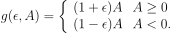

## Credits: ##
A lot of the code used for the skeleton of the algorithm is based
on <a href=https://github.com/ericyangyu/PPO-for-Beginners>ericyangyu</a> repository.

## Algorithm: ##
This is the pseudocode for the PPO algorithm used.
<div style="text-align: center;">
    <p></p>
    <p></p>
</div>


## Usage
First Use conda environment defined by 'environment.yml' file.

To train from scratch:
```
python main.py
```

To test model:
```
python main.py --mode test --actor_model ppo_actor.pth
```

To train with existing actor/critic models:
```
python main.py --actor_model ppo_actor.pth --critic_model ppo_critic.pth
```

NOTE: to change hyperparameters, etc. do it in [main.py](main.py).

## How it works

[main.py](main.py) is our executable. It will parse arguments, then initialize our environment and PPO model. Depending on the mode you specify (train by default), it will train or test our model. To train our model, all we have to do is call ```learn``` function!

[ppo.py](ppo.py) contains our PPO model. All the learning magic happens in this file.

[network.py](network.py) contains a simple Feed Forward Neural Network we can use to define our actor and critic networks for the PPO algorithm. 

[eval_policy.py](eval_policy.py) contains the code to evaluating the policy.
It's a completely separate module from the training code and this goes to show that once we have trained our network we are independent of the rest of the program.


## Additional Links ##

1. OpenAI article proposing PPO algorithm - https://arxiv.org/abs/1707.06347
2. OpenAI's explanation regarding PPO algorithm - https://spinningup.openai.com/en/latest/algorithms/ppo.html#id2


## IDEAS
1. Add prev choice to network params
2. Add constraint to network, so it allocate reward to biased alternative in 100 trial